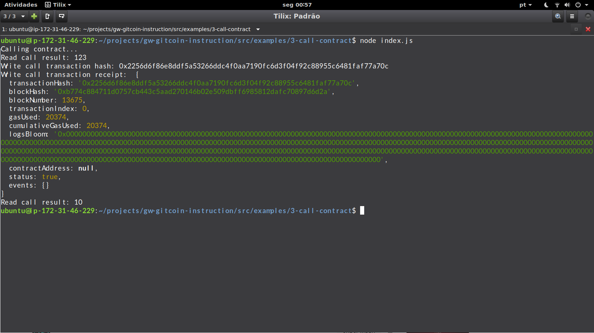

# Task3 Submission

1. Screenshot of successfully issued a smart contract call:

2. Transaction hash: 0x2256d6f86e8ddf5a53266ddc4f0aa7190fc6d3f04f92c88955c6481faf77a70c

3. Called contract address: 0x63bDcb29e06b77422b1945aC4Bd6CeFeA0360948

4. ABI:
[
    {
      "inputs": [],
      "stateMutability": "payable",
      "type": "constructor"
    },
    {
      "inputs": [
        {
          "internalType": "uint256",
          "name": "x",
          "type": "uint256"
        }
      ],
      "name": "set",
      "outputs": [],
      "stateMutability": "payable",
      "type": "function"
    },
    {
      "inputs": [],
      "name": "get",
      "outputs": [
        {
          "internalType": "uint256",
          "name": "",
          "type": "uint256"
        }
      ],
      "stateMutability": "view",
      "type": "function"
    }
]
