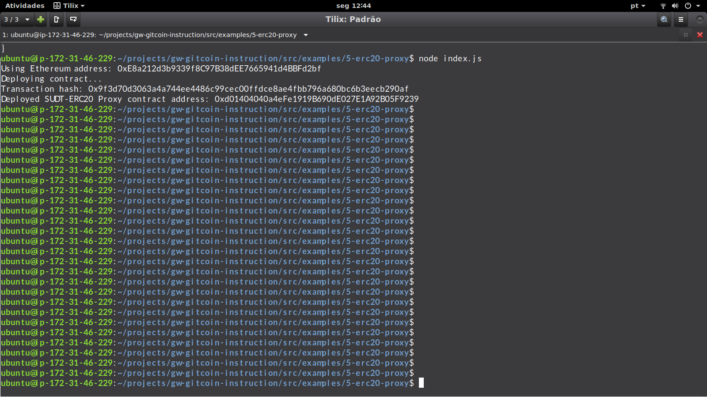

# Task5 Submission

1. A screenshot of the console output immediately after deploying smart contract.

2. The address of the ERC20 Proxy Contract:

0xd01404040a4eFe1919B690dE027E1A92B05F9239

3. A screenshot of the console output immediately after checking your SUDT balance.

4. The Ethereum address that was checked:

0xd01404040a4eFe1919B690dE027E1A92B05F9239
