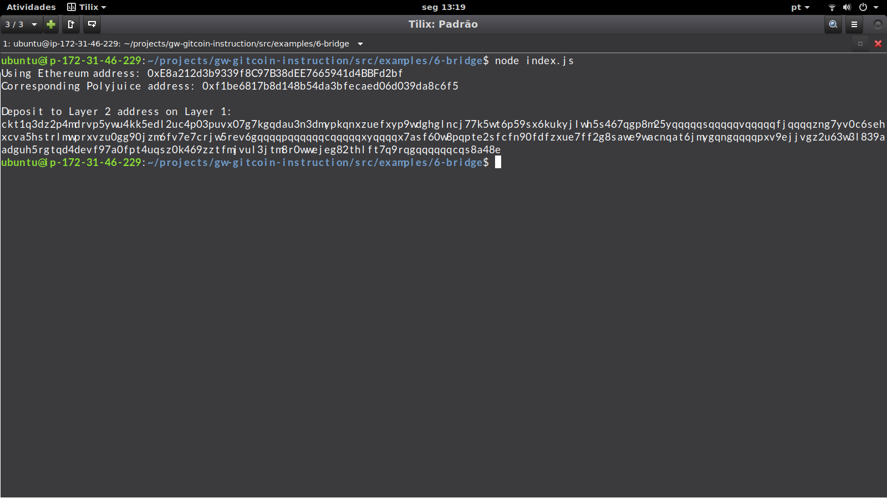

# Task6 Submission

1. successfully generated your Deposit Receiver Address:

2. Deposit Receiver Address:

ckt1q3dz2p4mdrvp5ywu4kk5edl2uc4p03puvx07g7kgqdau3n3dmypkqnxzuefxyp9wdghglncj77k5wt6p59sx6kukyjlwh5s467qgp8m25yqqqqqsqqqqqvqqqqqfjqqqqzng7yv0c6sehxcva5hstrlmwprxvzu0gg90jzm6fv7e7crjw5rev6gqqqqpqqqqqqcqqqqqxyqqqqx7asf60w8pqpte2sfcfn90fdfzxue7ff2g8sawe9wacnqat6jmygqngqqqqpxv9ejjvgz2u63w3l839aadguh5rgtqd4devf97a0fpt4uqsz0k469zztfmjvul3jtm8r0wwejeg82thlft7q9rqgqqqqqqcqs8a48e

3. Ethereum address used to generate the Deposit Receiver Address:

0xE8a212d3b9339f8C97B38dEE7665941d4BBFd2bf

4. Link to the Etherscan explorer for the successful Force Bridge transaction:

https://rinkeby.etherscan.io/tx/0xd8cfc63cf1d9aab9f2987536204cb43f444e0b0eaa9ddefacb87dc3a366c2534

5. Link to the Nervos explorer for the successful Force bridge transaction:

https://explorer.nervos.org/aggron/transaction/0xbf8a5b2cc998a584784e99ea2b2bf436bbc43ce044dac390ad902e1174a5d48a
