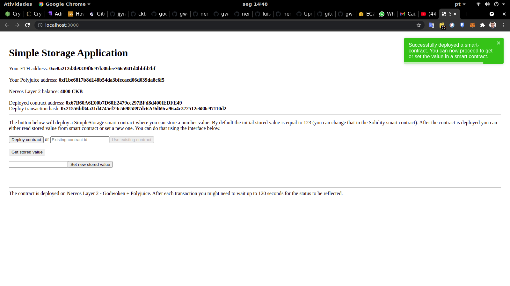

# Task7 Submission

1. Screenshots or video of your application running on Godwoken:

2. Link to the GitHub repository with your application which has been ported to Godwoken:

https://github.com/andermarce/nervos-hackaton/tree/main/task7_app

3. If you deployed any smart contracts as part of this tutorial, please provide the transaction hash of the deployment transaction, the deployed contract address, and the ABI of the deployed smart contract.

Deployed contract address: 0x67B60A6E00b7D60E2479cc297BFd8d400fEDFE49

Deploy transaction hash: 0x21556bf84a31d4745ef23c56985897dc62c9d69ca96a4c372512e680c97110d2

ABI: 

  "abi": [
    {
      "inputs": [],
      "stateMutability": "payable",
      "type": "constructor"
    },
    {
      "inputs": [
        {
          "internalType": "uint256",
          "name": "x",
          "type": "uint256"
        }
      ],
      "name": "set",
      "outputs": [],
      "stateMutability": "payable",
      "type": "function"
    },
    {
      "inputs": [],
      "name": "get",
      "outputs": [
        {
          "internalType": "uint256",
          "name": "",
          "type": "uint256"
        }
      ],
      "stateMutability": "view",
      "type": "function"
    }
  ],
