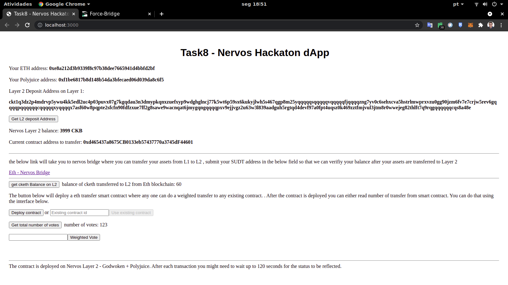
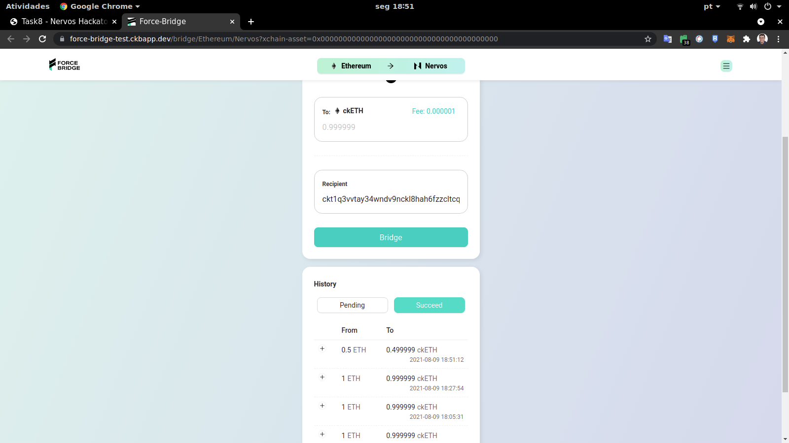

# Task8 Submission

1. Screenshot of your EVM application on Layer 2 with Force Bridge support:

2. The address of the SUDT-ERC20 Proxy Contract that you deployed:

0xd01404040a4eFe1919B690dE027E1A92B05F9239

3. Link to the GitHub repository with your EVM application that integrates Force Bridge support:

https://github.com/andermarce/nervos-hackaton/tree/main/task8_app/
